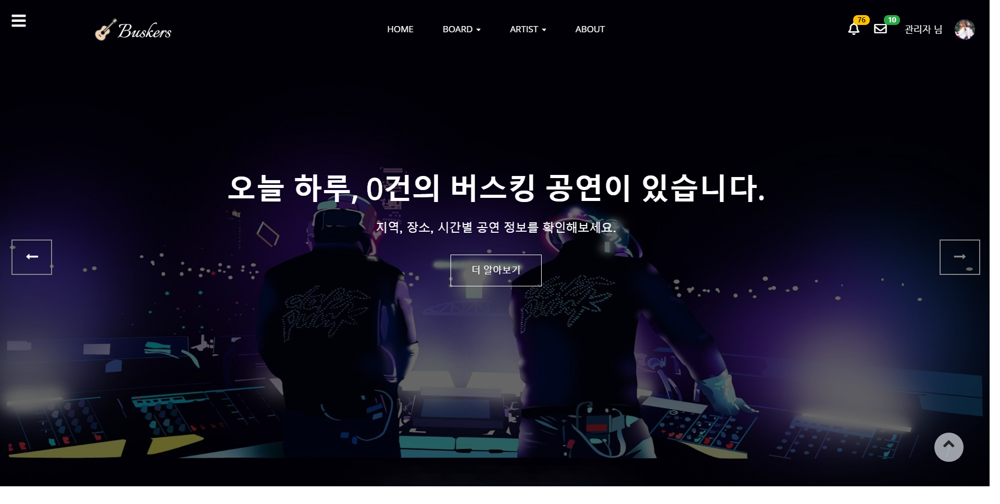
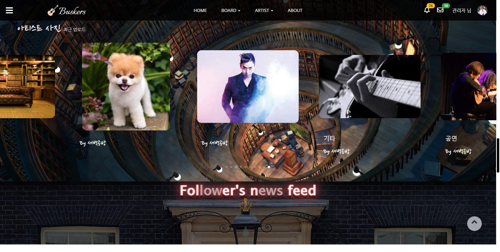
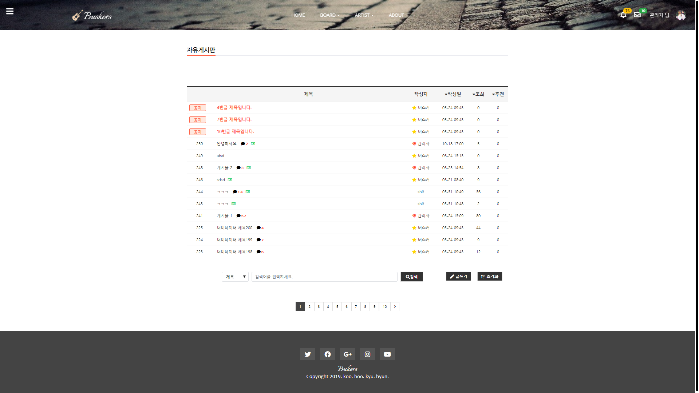
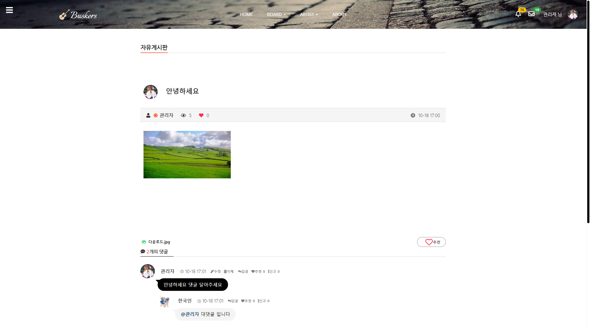
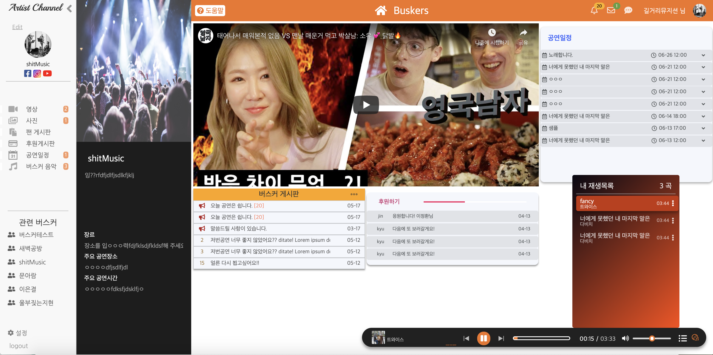
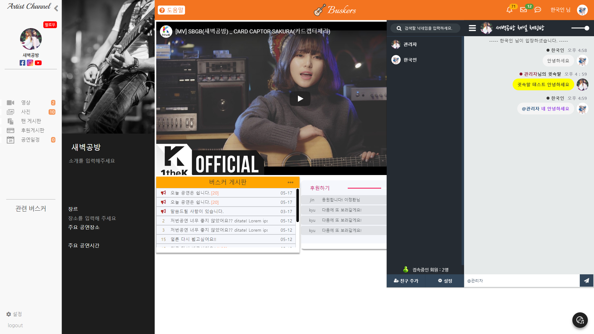
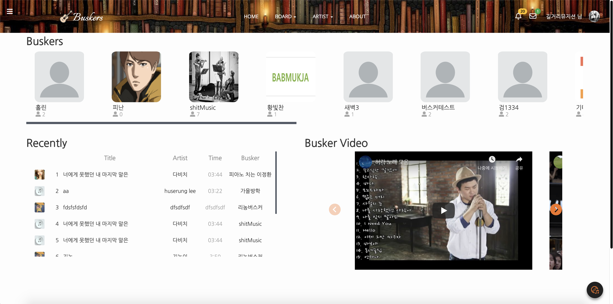

Buskers
=======

 

<br><br><br>
## 기획의도
- 거리공연(버스킹)에 대한 정보 공유를 할 수 있는 통합 사이트의 부재

  - sns나 커뮤니티 기능을 통합하여 제공하는 사이트를 기획
  - 사이트 사용자들의 소통공간 제공
  - 거리공연을 관람하는 사용자들에게는 정보를 제공
  - 거리공연을 하는 아티스트들에게는 홍보 수단을 제공

## 소개 영상
[](https://youtu.be/40c5HzLNzO8?t=0s)  
```
클릭 시 영상을 볼 수 있습니다.
```

## 발표 영상
[](https://youtu.be/4Wl7cpB9ulw?t=0s)  
```
클릭 시 영상을 볼 수 있습니다.
```

## 사용기술
- Back-End

  - spring
  - node.js
  - mybatis
  - mysql
  
- Front-End

  - jsp
  - jquery
  - html/css/javascript
  - d3.js
  - daum map
  - openweathermap 등.. api
  
- 협업도구

  - github
  - sourcetree
  - trello
  - google drive
  - google hangout
  
## 주요기능
크게 두 가지 기능으로 나뉘어져 있으며, 이해를 돕기 위해 **사용자 메인 페이지**와 **아티스트 페이지** 로 구분하였다

#### 사용자 메인
  > 일반적인 웹 사이트 기능을 제공하는 페이지이다  
    알람, 쪽지, 로그인 기능은 헤더에서 이용할 수 있다

  - 공연 지도
  
    - 공연 일정들을 지도에 표시하여 한 눈에 알아볼 수 있다
    - 지도 상에서 날짜와 지역으로 조회가 가능하다
    
  - 피드 (새 소식)
  
    - 최근에 올라온 공연일정 소식을 한 눈에 알 수 있으며, 해당 아티스트가 올린 사진이나 영상 또한 알 수 있다
    
  - 아티스트 소개
  
    - 등록되어 있는 아티스트들을 소개한다
    - 페이지 접속시 랜덤하게 아티스트 목록을 나열하여 매번 새로운 아티스트들을 소개하며 해당 아티스트가 올린 음악도 들을 수 있다
  
  - 게시판
    > 조회수, 추천 수, 시간 순 정렬이 가능하며 키워드 검색을 제공한다  
      댓글과 대댓글 기능을 제공한다
  
    - 공지사항
    - 자유게시판
    - 질문게시판
    - 업체등록 게시판
  
  - 마이페이지
    > 사용자들이 개인정보를 등록 수정하거나 조회할 수 있는 페이지
    
    - 개인정보 수정
    - 프로필 이미지 등록 또는 수정
    - 팔로우한 아티스트 관리
    - 버스커 관리
  
  - 실시간 알림
  
    - 자신이 팔로우한 아티스트의 새 소식이 등록되면 실시간으로 알림을 받아볼 수 있다
  
  - 쪽지
  
    - 회원들과 쪽지를 주고 받을 수 있다
    
  - 소셜 로그인
  
    - 카카오, 구글 계정으로 로그인이 가능하다
  
#### 아티스트 
  
  > 아티스트 페이지에서는 버스커 회원으로 등록된 회원에게 아티스트 개인 채널을 제공한다  
    이 개인 채널을 통해 해당 아티스트는 공연일정이나 사진, 영상등을 게시할 수 있고 팬들과 소통을 할 수 있다

  - 공연일정, 사진, 동영상
    
    - 아티스트는 공연일정, 사진, 동영상을 등록할 수 있다
    - 사용자는 아티스트의 공연일, 사진, 동영상을 조회할 수 있다
    
  - 관련 버스커
  
    해당 아티스트와 관련된 버스커들을 자동으로 추천해주는 기능
  
  - 팔로우
  
    - 사용자는 원하는 아티스트를 팔로우 할 수 있으며, 팔로우 한 아티스트들의 소식은 메인 페이지의 피드나 알림에서 받아볼 수 있다

  
  - 뮤직 플레이어
  
    - 아티스트는 원하는 음악을 등록할 수 있다
    - 사용자는 아티스트가 등록한 음악들을 들을 수 있다
    
  - 채팅
  
    - 아티스트 채널별로 각각의 채팅방을 제공
    - 귓속말 기능
    - 사용자 편의성 기능(현재 접속인원, 접속하거나 퇴장한 회원 알림 기능 등)
    - 새로운 채팅이 등록되면 실시간 알림 기능
    
## 본인이 맡은 부분
  
  메인 페이지의 거의 모든 전반적인 디자인과 기능을 풀스택으로 맡았다  
  
  메인 페이지에서는 공연 지도, 피드, 게시판, 쪽지, 실시간 알림 기능을 풀스택으로 개발  
  아티스트 페이지에서는 관련 버스커 추천 기능과 채팅 기능을 풀스택으로 개발  
  
  처음으로 하는 규모가 큰 프로젝트이다 보니 프론트 부분을 라이브러리를 이용하지 않고 직접 모두 개발하느라 고생을 하였다


## 주요 이미지

  
  
  
  
  
  
  
  



